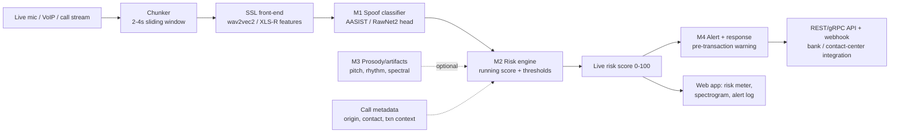

# SIH26104 — 36-Hour Build Plan
### "VoiceGuard" — Real-Time Voice-Cloning Detection & Impersonation Prevention

**Problem:** Detect AI-generated / cloned voices during live calls in near real time, compute a dynamic impersonation risk score, and trigger alerts *before* a sensitive action (fund transfer, data disclosure) is taken.
**Sponsor:** All India Council for Technical Education (AICTE) · **Dept:** Cyber Security Cell · **Theme:** Miscellaneous · **Category:** Software · **Difficulty:** Level 3 (MVP-feasibility 3/5)

> Why this wins for your team: the richest labeled data of any PS on your list + pretrained models to start from, and the most visceral demo in the building — you clone a judge's own voice on stage and your system flags it live. Your AI/ML members own detection + scoring; full-stack owns the real-time app and integration APIs.

---

## 1. Map AICTE's 6 components → your modules

AICTE listed six required components. Don't build all six deep — build the core deep, gesture credibly at the rest. Here's the honest mapping and priority:

| AICTE component | Module | Priority |
|---|---|---|
| Multi-layer voice authenticity analysis (acoustic/spectral) | **M1 – Detection core** | 🔴 Must |
| Real-time risk scoring engine (continuous score, thresholds) | **M2 – Streaming + risk engine** | 🔴 Must |
| Alerting & user-interaction layer (pre-transaction warnings) | **M4 – Alert/response + UI** | 🔴 Must |
| Prosody/behavioral analysis + explainability | **M3 – Prosody & explain** | 🟡 Depth |
| Platform & integration APIs (REST/SDK) | part of **M4** | 🟡 Depth |
| Privacy & compliance (edge/feature-only) + multilingual (Indian accents) | **design + framing** | 🟢 Pitch |

**Scope discipline:** M1 + M2 + M4 (detection → live risk score → pre-transaction warning) is the complete winning story. Prosody (M3), cross-session speaker consistency, and per-language acoustic models are *depth* — pull them in only if the core is solid by hour 24. Privacy and multilingual are strongest as **design decisions you can articulate**, not full builds.

---

## 2. System architecture

Everything hangs off a **running risk score**. The classifier produces per-window probabilities; the risk engine smooths them into a live 0–100 score and fires the alert when it crosses a configurable threshold.

---

## 3. Data sources — free and rich

| Data | What it is | Access | Use |
|---|---|---|---|
| **ASVspoof 2019 LA** | Bonafide + 19 TTS/VC attacks (clean) | Free (Edinburgh DataShare / Zenodo) | Primary train/dev |
| **ASVspoof 2021 LA + DF** | 100+ attack algorithms, codec/telephony channels | Free | Train + realistic eval |
| **MLAAD** (Multi-Language Anti-Spoofing) | Multilingual fake speech — *your Indian-language angle* | deepfake-total.com/mlaad | Multilingual robustness |
| **In-the-Wild** | Real-world fake/real clips (not studio-clean) | Free | Generalisation test |
| **WaveFake** | Generated audio, 6 architectures | Free | Extra attack diversity |
| **Pretrained SSL** | wav2vec2 / **XLS-R** (multilingual) encoders | HuggingFace / fairseq | Front-end (don't train from scratch) |
| **Open baselines** | AASIST, RawNet2, SSL-AASIST, SpeechBrain recipes | GitHub | Start from a working model |
| **Voice-cloning tool** | Coqui XTTS-v2 / OpenVoice (open TTS/clone) | GitHub / HF | *Generate the live attack for the demo* |

**Two data realities to plan around:**
1. **ASVspoof is clean; real calls aren't.** A model trained only on ASVspoof 2019 overfits to studio conditions and fails on telephony. Mix in ASVspoof 2021 (codec/channel) + In-the-Wild so it generalises — and *say this to judges*, because generalisation to unseen attacks is the field's core unsolved problem and shows you know it.
2. **Don't train per-language models.** Use a **multilingual SSL front-end (XLS-R)** so features are language-agnostic, then test on Indian-accented / Hindi samples (generate a few with the cloning tool). This satisfies the "Indian languages/accents" requirement without building N models.

---

## 4. Tech stack

- **Front-end model:** `wav2vec2` / `XLS-R` via HuggingFace `transformers` + `torchaudio`. Use as feature extractor (frozen or lightly fine-tuned).
- **Classifier head:** **AASIST** (graph attention spectro-temporal) or **RawNet2** — clone an open repo; `SpeechBrain` also has anti-spoofing recipes. Metric: **EER (Equal Error Rate)** on a held-out *unseen-attack* set.
- **Real-time:** `sounddevice`/`pyaudio` for mic; `FastAPI` + **WebSocket** for streaming chunks; running score via EMA. Target < ~1s latency.
- **Prosody/explain (M3):** `librosa`/`praat-parselmouth` for pitch contour, jitter/shimmer, pause statistics; spectrogram artifact heatmap.
- **Backend:** `FastAPI` — `/analyze` (file), `/stream` (WebSocket), `/config` (thresholds), alert `/webhook`.
- **Frontend:** React + **Web Audio API** (mic capture, live waveform + spectrogram), websocket to backend, animated risk meter + alert log.
- **Attack generation:** Coqui **XTTS-v2** or **OpenVoice** — clone a target voice from a few seconds of audio for the live demo.

---

## 5. Module deep-dives

### M1 — Detection core (the model)
1. Pipeline: raw audio → SSL front-end (wav2vec2/XLS-R) → pooled features → AASIST/RawNet2 head → `bonafide` vs `spoof` + probability.
2. Train on ASVspoof 2019 LA; **evaluate cross-dataset** on ASVspoof 2021 DF + In-the-Wild to prove generalisation. Report EER on the *unseen* set, not the train set.
3. Time-saver: start from a **pretrained SSL-AASIST checkpoint** if available and fine-tune — do not train wav2vec2 from scratch.

### M2 — Streaming + risk engine (the "real-time")
1. Sliding window: 2–4s chunks, hop 0.5–1s. Classify each window.
2. **Running risk score** = EMA of per-window spoof probability, scaled 0–100. This makes the meter move smoothly during a call.
3. **Configurable thresholds** per scenario (e.g., high-value transaction call = stricter). Above threshold → fire event to M4.
4. Optional **contextual enrichment**: bump score using metadata (unknown caller ID, high-value transaction context) — even a simple rule-based bump demonstrates the "contextual" requirement.

### M3 — Prosody & explainability (depth / differentiator)
- Extract pitch contour, rhythm/pause micro-variations, jitter/shimmer — TTS often has unnaturally smooth prosody.
- **Explainability panel:** show *which* segments/artifacts drove the spoof verdict (spectrogram heatmap + "flat pitch contour, phase artifact at 3.2s"). This directly answers AICTE's "granular analysis of acoustic artifacts and prosody" line and massively strengthens the pitch.

### M4 — Alert / response + integration API (the "prevention")
- On threshold breach: **pre-transaction warning** — "⚠ Likely synthetic voice (risk 88). Recommend call-back / MFA before approving." This is the *prevention* half of the title; don't skip it.
- Multi-channel alert (UI prompt + simulated SMS/email/webhook log).
- Expose **REST API + webhook** so it plugs into a bank/contact-center flow. Ship a tiny SDK snippet (a `verify_call()` client function) to make "integration-ready" concrete.

### M5 — Web app / demo UI
- Live mic capture → **animated risk meter** (green→amber→red), live waveform + spectrogram, rolling verdict, alert log.
- A "call simulation" view: caller panel + running risk + the pre-transaction warning popping up mid-"call." This *is* the demo.

---

## 6. The 36-hour timeline (6-person team, parallel tracks)

Roles: **ML-1** (detection model), **ML-2** (streaming + risk engine), **ML-3/Data** (prosody/explain + attack generation + Indian-accent test set), **BE** (API + alert/response), **FE** (real-time UI), **Flex** (integration + pitch).

| Hours | ML-1 | ML-2 | ML-3/Data | BE | FE | Flex |
|---|---|---|---|---|---|---|
| **0–2** | Env, download ASVspoof, clone AASIST/SSL repo | Chunking + mic capture prototype | Set up XTTS/OpenVoice, generate attack clips | Scaffold FastAPI + API contract | Scaffold React + mic (Web Audio) | Lock scope, pick demo flow |
| **2–8** | Fine-tune SSL-AASIST on ASVspoof 2019 | Per-window inference on a WAV | Build Indian-accent + Hindi test clips | Stub `/analyze` + `/stream` (WebSocket) | Waveform + spectrogram render | Pitch skeleton, define golden demo |
| **8–14** | Cross-dataset eval (2021 DF / In-the-Wild), report EER | Running risk score (EMA) + thresholds | Prosody features + artifact heatmap | Wire `/stream` to real model | Live risk meter from websocket | Integration test M1→M2 |
| **14–20** | Freeze best model, export checkpoint | Contextual score bump (metadata rule) | Explainability panel data | `/config` thresholds + alert `/webhook` | Alert popup + pre-transaction warning UI | End-to-end on mic input |
| **20–26** | Cache demo verdicts | Latency tuning (<1s) | Cache attack clips + explain outputs | Tiny SDK snippet + webhook log | Call-simulation view, polish | Full live run: clone → detect → warn |
| **26–30** | Buffer / robustness | Buffer | Prep multilingual demo clip | Freeze backend | UI polish, legend, loading states | Rehearse demo x2 |
| **30–33** | Support | Support | Support | Stabilise | Freeze UI | **Rehearse x3**, prep fallbacks |
| **33–36** | — | — | — | — | — | Final deck, buffer, submit |

**Golden rule:** by **hour 20** the mic → live risk meter → alert loop must work end-to-end on your own voice. Everything after is generalisation, explainability, and polish.

---

## 7. Demo strategy — the live clone

The killer moment is cloning a real person's voice on stage. Stage it safely:
- **Before the demo:** clone a teammate's (or a consenting judge's) voice with XTTS/OpenVoice from a 10–15s sample; pre-generate a "fraud call" clip ("Hi, transfer ₹2 lakh to this account urgently").
- **Live:** first speak genuinely → meter stays green. Then play the cloned "fraud call" → meter spikes red → pre-transaction warning fires. Same voice, opposite verdict. That contrast *is* the pitch.
- **Fallbacks:** pre-recorded genuine + cloned clips cached in the app; a 60-second screen recording of a clean run as ultimate backup. Never depend on live cloning working in the room.
- Keep a **second attack** (different TTS engine) to answer "does it catch attacks it wasn't trained on?"

---

## 8. Exact demo script (~3.5 minutes)

**[0:00–0:25] Hook.** "In India, voice-clone fraud is exploding — fake kidnapping calls, 'digital arrest' scams, CEOs impersonated to approve transfers. All it takes is a few seconds of your voice. Meet VoiceGuard — it catches the clone *while the call is happening.*"

**[0:25–1:05] Genuine baseline.** Teammate speaks live into the app. "This is a real human voice — our engine scores every 2 seconds. Risk stays green, near zero. It's running a self-supervised model that analyses acoustic and spectral artifacts, not just caller ID."

**[1:05–2:05] The attack — payoff.** "Now the same voice — cloned by AI from a 15-second sample." Play the fraud clip. *(Risk meter climbs → red.)* "Watch the score: it's crossed our high-value-transaction threshold, and —" *(warning pops)* "— *before any money moves*, VoiceGuard tells the bank teller: likely synthetic voice, do a call-back and MFA. That's the fraud stopped."

**[2:05–2:45] Depth.** Open the explainability panel. "It's not a black box — here's *why*: unnaturally flat pitch contour, a phase artifact at 3.2 seconds. And because our features are language-agnostic, it works across Indian accents and Hindi —" *(play a Hindi cloned clip, meter spikes)*.

**[2:45–3:20] Integration + privacy.** "It exposes a REST API and SDK, so a bank or telecom drops it into an existing call flow in a few lines. And it's privacy-first: inference runs on features, we log risk scores — not your voice."

**[3:20–3:30] Close.** "VoiceGuard: real-time trust for every voice call. We catch the clone before it costs you."

---

## 9. Risk register

| Risk | Likelihood | Mitigation |
|---|---|---|
| Model overfits ASVspoof, fails on real audio | High | Train with 2021 + In-the-Wild; report cross-dataset EER honestly |
| Live cloning flops in the room | High | Pre-generate clips; cached genuine+fake; recorded backup |
| Real-time latency too high | Medium | Frozen SSL features, small head, 2–4s windows, EMA |
| Live mic / browser audio issues | Medium | "Upload clip" fallback path + cached stream |
| XTTS/OpenVoice setup eats hours | Medium | Install + generate clips in **pre-hackathon prep** |
| Over-scoping prosody / multilingual / SDK | High | Core = detect→score→warn; rest is depth/framing |

---

## 10. Judge-facing framing (memorise these)

- **Why AICTE Cyber Security Cell cares:** voice-clone fraud is a national cyber-resilience issue — banking fraud, social engineering against officials, erosion of trust in voice channels. You're building a *reusable security layer*, not a toy classifier.
- **Your technical edge:** (1) **generalisation** — you evaluate on unseen attacks and telephony conditions, not just clean train data; (2) **explainability** — you show *why* it's a clone; (3) **prevention, not just detection** — the pre-transaction warning is the whole point.
- **Honesty that scores points:** state that no detector is perfect against future TTS, which is exactly why you pair a live risk score with a *human-in-the-loop* recommendation (call-back / MFA) rather than auto-blocking. That's mature security design.

---

## 11. Do BEFORE hour 0 (pre-hackathon prep)

- [ ] Download ASVspoof 2019 LA + 2021 (LA/DF); grab In-the-Wild + a slice of MLAAD
- [ ] Clone an open baseline repo (SSL-AASIST / RawNet2) and get it running on a few samples
- [ ] Pull a pretrained **XLS-R** checkpoint (multilingual front-end)
- [ ] Install **Coqui XTTS-v2 / OpenVoice**, test-clone a voice, save genuine + cloned demo clips (incl. one Hindi/Indian-accent clip)
- [ ] Repo skeleton: `/detection /streaming /prosody /backend /frontend`; agree the WebSocket + REST API contract
- [ ] Smoke-test installs: torch, torchaudio, transformers, librosa, parselmouth, fastapi, sounddevice, react + web-audio

---

*Build the core (detect → live risk score → pre-transaction warning), make the live-clone contrast land, rehearse three times. Same voice, opposite verdict — that's your winning moment.*
